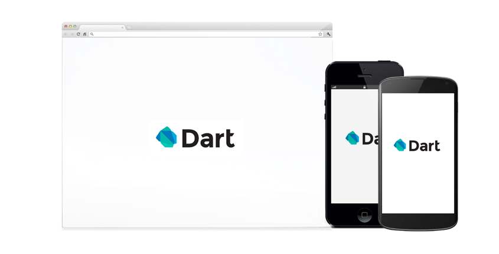
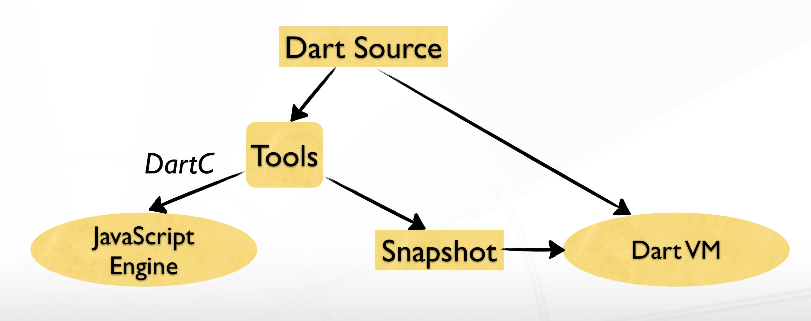

<h1 style="padding-top:150px" class="text-center">The Dartlang</h1>
<p class="text-center"><strong>Andy Ai</strong></p>

---

# DART: A STRUCTURED WEB PROGRAMMING LANGUAGE

- Object oriented
- For better performance
- Class-based single inheritance
- Interfaces with default implementation
- Optional static types
- Generics
- Real lexical scoping
- Single-threaded
- Modular

---

# RUN IN ALL MODERN BROWSERS



---

# DART EXECUTION



---

# STATIC TYPES

- Numbers
  - num
  - int
  - double
- Strings
  - String
- Booleans
  - bool

---

# COLLECTIONS

- List

```dart
var names = new List<String>();
names.addAll(['Andy', 'Bob']);
```

- Set
```dart
Set<String> topic = new Set();
topic.addAll(['News', 'Techs']);
topic.remove('Techs');
```

- Map
```dart
var map = {'key' : 'Value'};
assert(map['key'] == 'One')
```

--

